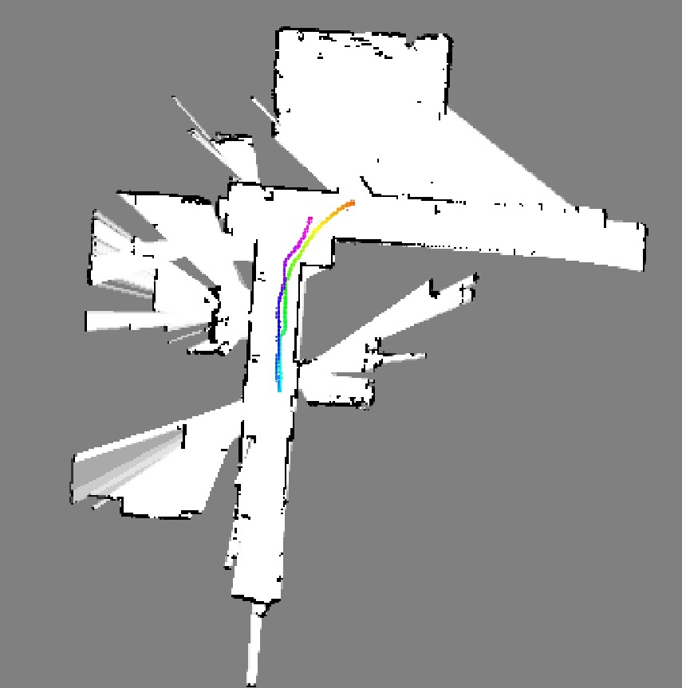
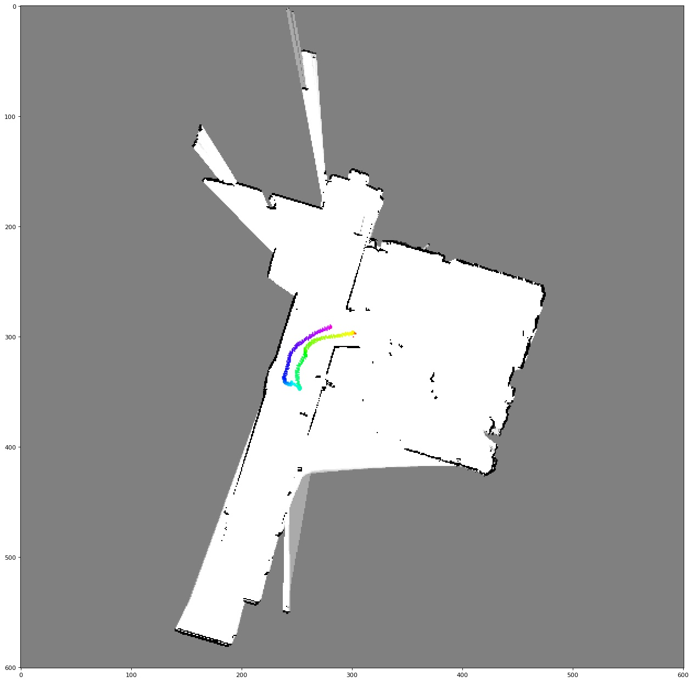
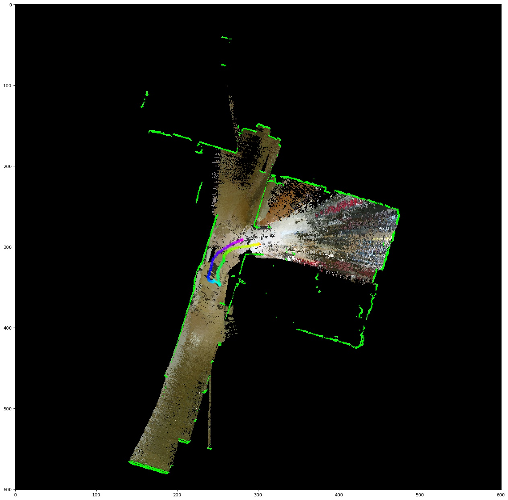
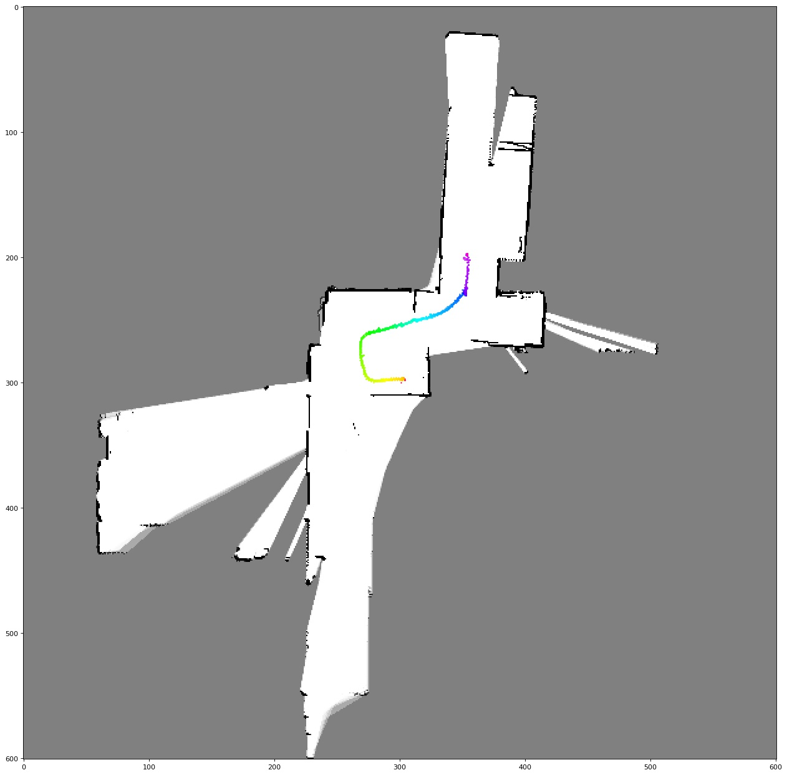
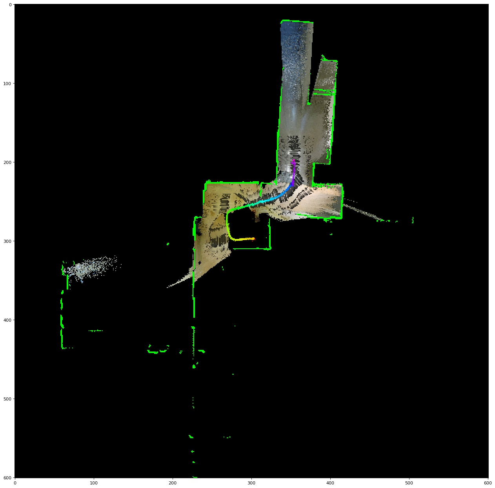
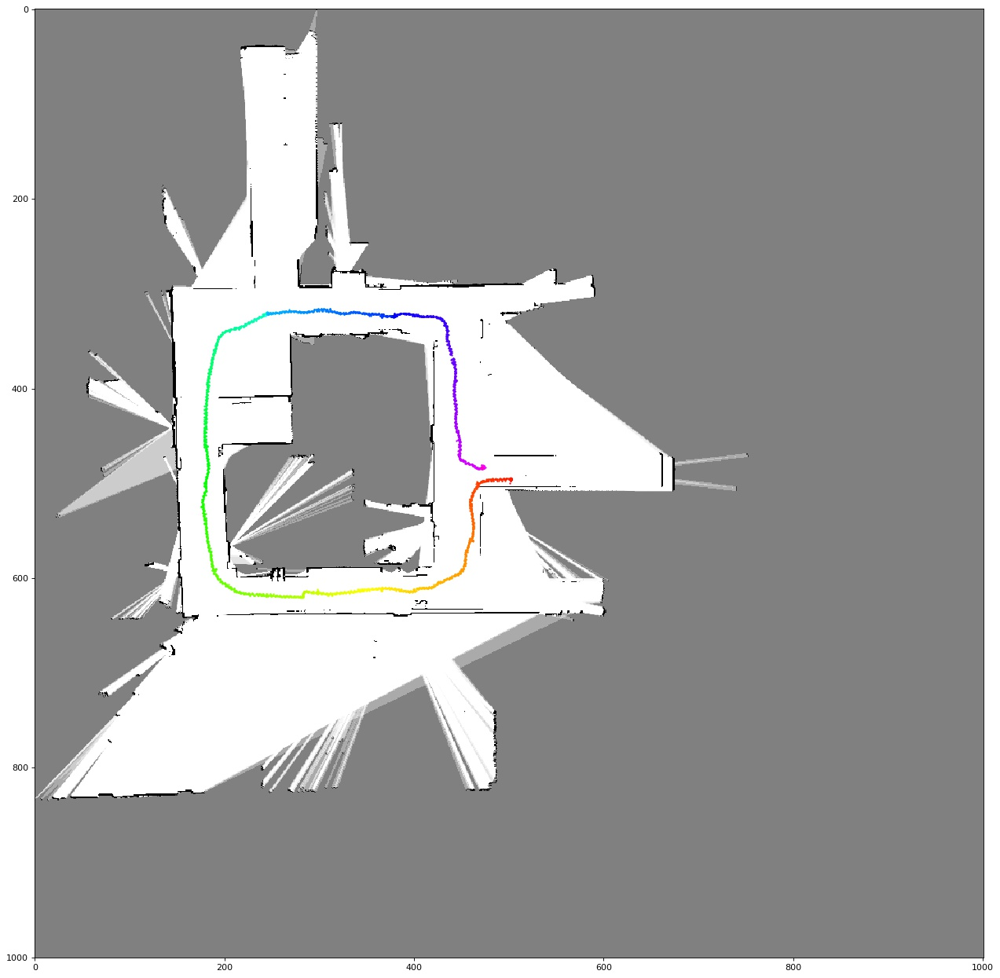
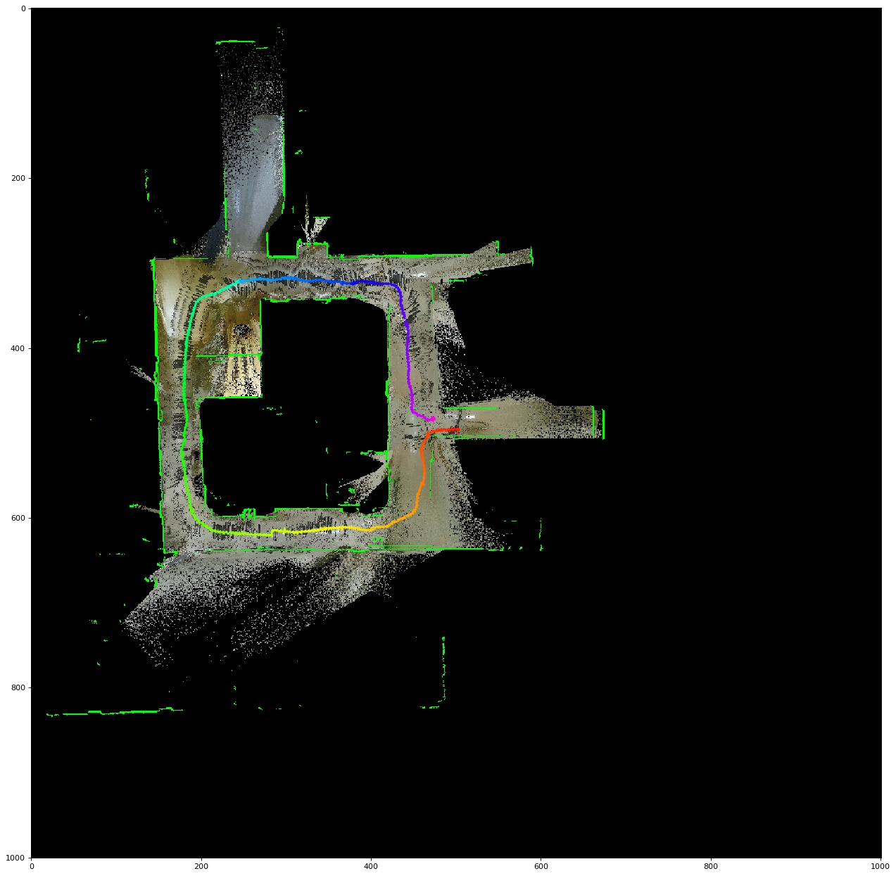

# Particle Filter SLAM and Texture Mapping
This is the project 2 of the course UCSD ECE276A: Sensing & Estimation in Robotics.

Simultaneous Localization And Mapping (SLAM) is a challenging topic in robotics and has been researched for a few decades. When building a map from the observations of a robot, a good estimate of the robot's location is necessary. However, a robot needs a consistent and reliable map for localization. SLAM is the computational problem to simultaneously estimates a map of environment and pose of a moving robot relative to that map, without any a-priori information external to the robot except for the observations of the robot. SLAM approaches are capable of building the map online while correcting the errors of its pose estimate as it sensing the surroundings.

In this project, we develop a solution for SLAM based on particle filter and occupancy grid. We extend this solution for texture mapping, which project color points from the RGBD sensor onto the occupancy grid in order to color the floor. Our solution is evaluated with real-world odometry data, indoor 2-D laser scans, and RGBD measurements from THOR, a humanoid robot with lidar and Kinect v2 installed. It is able to estimate reliable map and robot trajectory on various dataset in reasonable time.

## Project Report

* [Chun-Nien Chan. "Particle Filter SLAM with Texture Mapping." 27 Feb. 2020. ECE 276A, UCSD, student paper](report/particle_filter_slam.pdf)

## Screenshots

Particle Filter SLAM | Texture Mapping
--------------------|---------------------
|
|
|

## Implementations:
### Source files:
- src/map.py: Classes for occupancy grid map.
    - Map2D: Class for 2D occupancy grid map. By setting the range of x and y axis and resolution, this class automatically
    builds the grid map and provides methods to convert world coordinates to pixel indicies
- src/robot.py: Classes and functions for THOR robot.
    - Transform: Transform matrix generator. By creating an instance with the current THOR robot state, this class automatically build transform matrices between different frames.
    - undistort_(ir/rgb): undistort color and depth image with predefined calibration parameters
    - align_ir_rgb: align color and depth image with predefined extrinisic and parameters.
- src/slam.py: ParticleFilterSLAM class for experiment
- src/util.py: utilities for robot trajectory, occupancy map, and texture map visualization
    - plot_map: plot and save the map and robot trajectory image

### Tools:
- tools/make_traindata.py: making training data pickle files, this script load robot data from raw files (.mat) with project provided function, align timestamps, transform lidar scan to lidar frame in [x, y, z], and save the data to a pickle file. The experiment notebooks all use the pre-processed pickle file instead of raw robot data.
- tools/make_video.py: make video from experiment output images

### Notebooks:
- SLAM_\<id>: The particle filter SLAM experiment on data set \<id>.

## References
* [UCSD ECE276A: Sensing & Estimation in Robotics](https://natanaso.github.io/ece276a/)
